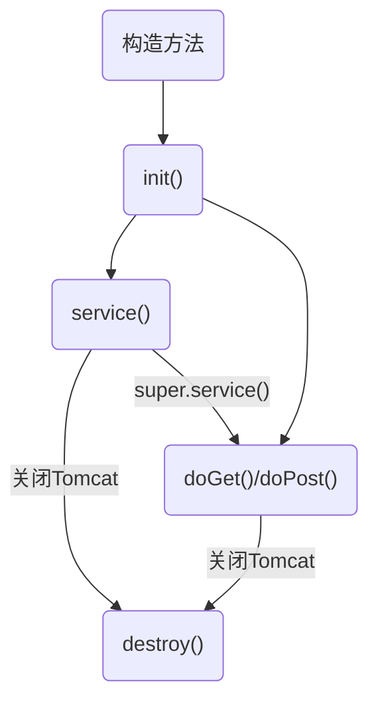
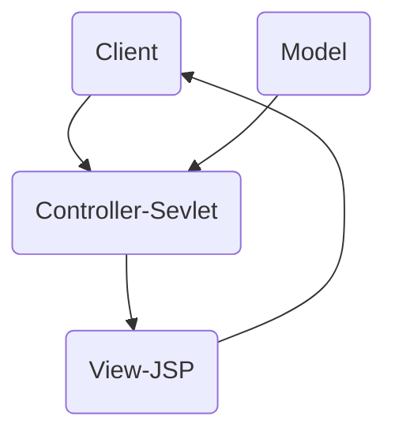
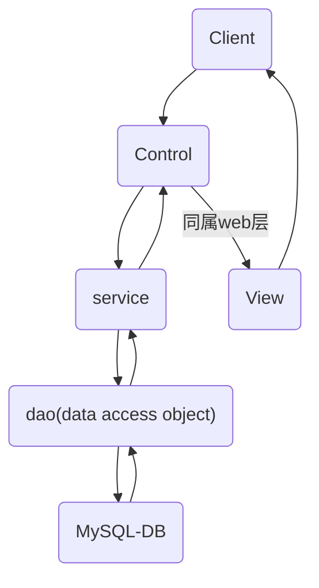

# JSP与Servlet
>#### 此笔记配合视频为
>>[《【SiKi学院JavaEE视频教程】JavaWeb第一季基础》](https://www.bilibili.com/video/av37398251)
>>[《【SiKi学院JavaEE视频教程】JavaWeb第二季进阶》](https://www.bilibili.com/video/av37398729)
>>
>>或 [Siki学院官网](http://www.sikiedu.com) 

>#### 前言
>>经个人了解，jsp已近退休之势，各位小伙伴不必深究，浅尝辄止即可。
>>Servlet则需深入理解，这是日后很多框架的基础。

## JSP基本语法
#### 引入
```jsp
<%@page import=""%>
```
#### 注释
```jsp
<%-- code --%>
```
#### 书写
```jsp
<% code %>
```
#### 定义表达式
```jsp
<%! 成员变量 %>
```

#### 引入标签
>一般可用与导入多张网页重复的<header>或<footer>
```xml
<jsp:include page="xxx.jsp"></jsp:include>
```

## 内部类与其常用方法
>#### out (== sou)
>>println() 
>>用于println() 用于输出，也可用“=”代替 
>#### request（生命周期只在一次HTTP内）
>>1. getParameter() 
>>获取参数
>>2. getRequestDispatcher(url).forward(request, response) 
>>请求转发 request_do->login->client （路径问题需注意）
>>3. setAttribute(key, content)/getAttribute(key) 
>>传值
>>4. getSession() 
>>获取session对象
>>5. getContextPath() 
>>获取项目路径，用于相对路径
>#### response
>>1. getWriter().println() 
>>写在html头
>>2. getWriter().append() 
>>追加
>>3. sendRedirect(url) 
>>重定向 request_do->client->login
>#### session
>> setAttribute(key, content)/getAttribute(key) 
>> 传值
>#### application（唯一对象）
>> setAttribute(key, content)/getAttribute(key) 
>> 传值
>#### page
>>== this关键字
>#### pageContext （容器）
>>1. getOut() 
>>获取out对象
>>2. getRequest() 
>>req
>>3. getResponse() 
>>resp
>>4. getServletContext() 
>>app
>>5. getSession() 
>>session

## Servlet
>只作流程处理，与jsp分离。
>extend HttpServlet throw ~Exception
>通过重写doGet(req, resp) and doPost(req, resp) 来使用
>
>以注解@WebServlet("url") 定位
>也可使用web.xml定位（创建项目时next勾选可自动创建）
```xml
<servlet>
<servlet-name>LoginServlet</servlet-name>
<servlet-class>
com.sikiedu.servlet.LoginServlet
</servlet-class>
</servlet>
<servlet-mapping>
<servlet-name>LoginServlet</servlet-name>
<url-pattern>/login_ do</url-pattern><!-- 访问路径-->
</servlet-mapping>
</servlet>
```
***
>#### 生命周期


## el表达式
>用于简化jsp的写法，减轻代码量，优化可读性。

#### 取变量
>1. \${var}
>2. \${~Scope.var} 
>
>（~为req，session，application）
>（scope优先级为req，session，application）
>
>***一般使用第一种形式即可***

#### 取类变量
>\${class.var}

#### 取map和集合
>${map.key} and ${list[index].var}

#### 运算
>\${+-\*/}
>\${> < == || !} 
>\${empty var}

#### 内部类
>${pageContext.request.contextPath}

## jstl标签
>进一步简化jsp写法，优化代码可读性。
>具有现代一些数据驱动型前端框架的语法雏形。
>如Vue.js、Angular.js。

#### 下载jar包
>[下载链接 -\> mvnrepository](
https://mvnrepository.com/artifact/javax.servlet/jstl/1.2)

#### 引入
```xml
<%@ taglib uri="http://java.sun.com/jsp/jstl/core" prefix="c" %>
```
#### 定义值
```xml
<c:set var="" value="" scope=""></c:set>
```
#### 消除值
```xml
<c:remove var=""/>
```
#### 输出值
```xml
<c:out value=""/>
```
#### 条件判断
```xml
<c:choose>
<c:when test="${condition}">code</c:when>
<c:otherwise>code</c:otherwise>
</c:choose>
```
#### 循环
```xml
<c:foreach var="i" begin="index1" end="index2">
code
</c:foreach>
<c:foreach items="${list}" var="x">${x.var}</c:foreach>
```
## json
>全称是"JavaScript Object Notation"，
>轻量级的数据交换格式，原型是JavaScript中的数据对象。
>[详细了解](https://www.json.org/json-zh.html)

## fastjson
>阿里出品的开源Java端json操作库。
>[fastjson的官方GitHub](https://github.com/alibaba/fastjson)

#### 下载jar包
>[下载链接->mvnrepository](https://mvnrepository.com/artifact/com.alibaba/fastjson/1.2.62)

#### 引入
```java
import com.alibaba.fastjson.JSON
```
#### 序列化
```java
JSON.toJSONString(object);
```
#### 反序列化
```java
JSON.parseObject(String, object.class);
```
#### 序列化数组
```java
JSON.parseArray(String, object.class);
```

## ajax
>全称是"Asynchronous Javascript And XML"，
>一种通过异步请求达到不刷新网页更新数据的技术。
>***这是JavaScript中的技术，并非Java中的。***

#### JQuery实现
```JavaScript
setInterval("callAjax()", 2000);//定时调用方法，参数单位为毫秒
function callAjax() {
    $.ajax({
        url: "${pageContext.request.contextPath }/ajaxrequest" ,
        type:"get",
        success: function(msg){
            }
});
$("input").blur(callAjax); //失焦响应方法
```
#### 原生JS实现
```JavaScript
function callAjaxByJS(){
    var xmlhttp = new XMLHttpRequest();
    xmlhttpopen("GET", endcodeURI("${pageContext.request.contextPath}/ajaxRequest?data=我是数据&"+Math.random()), true)
    xmlhttp.send();
    xmlhttp.onreadystatechange = function(){
    if( xmlhttp.readyState==4 && xmlhttp.status==200 ){
     //得到了服务器端的响应，4代表ajax响应已完成，200是http正常状态码
            $("#msg").append(xmlhttp.responseText);
        }
    }
}
```

## Filter
>class implement Filter

#### 生命周期
>构造方法->init()->doFilter()->destory()

#### doFilter()
>chain.doFilter()将启动过滤链。
```java
public void doFilter(ServletRequest request, ServletResponse response, FilterChain chain) throws IOException, ServletException{ 
    // TODO Auto-generated method stub
    // place your code here
    System.out.println("test1 filter before");
    // pass the request along the filter chain
    chain.doFilter(request, response);
    System.out.println("test1 filter after");
}
```
>通过web.xml配置过滤条件及顺序，
>也可使用@WebFilter("/\*")设置条件。
```xml
<filter> 
<filter-name>Test1Filter</filter-name><!-- 名称 -->
<filter-class>com.sikiedu.filter.Test1Filter</filter-class><!-- 类名 -->
</filter>
<filter>
<filter-name>Test2Filter</filter-name>
<filter-class>com. sikiedu.filter.Test2Filter</filter-class>
</filter>
<filter-mapping>
<filter-name>Test2Filter</filter-name>
<url-pattern>/*</url-pattern><!-- 过滤目录 -->
</filter-mapping>
<filter-mapping>
<filter-name>Test1Filter</filter-name>
<url-pattern>/*</url-pattern>
</filter-mapping>
```
>web.xml中设置的顺序在response时会反向，
>即执行书写在chain.doFilter()之后的代码。
>一般没有必要使用。

#### 权限管理过滤
```xml
<filter>
<filter-name>AdminFilter</filter -name>
<filter-class>com.sikiedu.filter.AdminFilter</filter-class>
<!-- 继承自Filter的类-->
</filter>
<filter-mapping>
<filter-name>AdminFilter</filter-name>
<url-pattern>/admin/*</url-pattern>
<!-- 此处为路径，*是通配符，代表所有 -->
</filter-mapping>
```

#### 请求过滤
>通过client对jsp发起的请求类型进行过滤。
>***此请求并非指get与post，而是jsp所定义的请求类型。***
```xml
<filter>
<filter-name>DispatcherFilter</filter-name>
<filter-class>com.sikiedu.filter.DispatcherFilter</filter-class><!-- 继承自Filter的类--> 
</filter>
<filter-mapping>
<filter-name>DispatcherFilter</filter-name>
<url-pattern>/dispatcher1. jsp</url-pattern>
<dispatcher>ERROR</dispatcher>
</filter-mapping>
```
>dispatcher类型共有五种，常用的是前四种。
>>1. REQUEST 普通请求
>>2. FORWARD 请求转发
>>3. INCLUDE \<jsp:include\>
>>4. ERROR 错误请求
>>5. ASYNC 异步请求???
>>#### 错误页面设置
```xml
<error-page>
<error-code>404</error-code>
<location>/dispatcher1.jsp</location>
</error-page>
```

## 监听器
>1. 监听器是一个类，创建类
>2. 实现监听器接口
>>创建和销毁状态监听
>>~initialized()  ~Destroyed()
>>>javax.servlet.ServletContextListener
>>>HttpSessionListener
>>>ServletRequestListener
>>
>>属性监听
>>~Added()  ~Replaced()  ~Removed()
>>>ServletContextAttributeListener
>>>HttpSessionAttributeListener
>>>ServletRequestAttributeListener
>>
>>Session绑定监听
>>>1. 使model implements HttpSessionBindingListener
>>>2. 重写valueBound()和valueunbound()方法


>3. 配置
```xml
<listener>
<listener-class>package.Listen-name.class</listener-class>
</listener>
```
>4. 设置session超时时间
```xml
<session-contig>
<session-timeout>1</session-timeout><!-- 单位为分钟-->
</session-config>
```

# 特殊知识点 
## MVC架构


## J2EE分层架构

## 单例模式
>私有化构造方法，建立instance。
>避免多次new常用对象。
```java
public static JDBCUtil instance = new JDBCUtil();
private JDBCUtil() {

}
```

## 相对路径与绝对路径
#### 客户端路径
>在客户端地址栏或源代码中显示并可以请求。
>如<a href="URL">和访问的URL。

>相对路径
>>以当前URL目录所在的路径确定。
>>
>绝对路径
>>以主机（域名）根路径确定。
>>***一般通过加上contextPath保持路径正确。***
>><u><%=request.getContextPath()%></u>
>>或<u>\${pageContext.request.contextPath}</u>

#### 服务端路径
>只在jsp内部执行。
>如\<jsp:include page="xxx.jsp">或请求转发。

>相对路径
>>以当前jsp文件所在的路径确定，形如"xxx.jsp"。
>>
>绝对路径
>>以项目路径确定，形如"/folder/xxx.jsp"。
>>***无需加上项目名。***

#### ***实际使用均建议使用<u>绝对路径</u>，避免错误。***

## 中文参数乱码解决
>String设置编码
```java
System.out.println(new String(sex.getBytes("iso-8859-1"), "utf-8"));
```
>request设置编码
```java
request.setCharacterEncoding("utf-8");
```
>response设置编码
```java
resp.setContentType("text/html; charset=utf-8");
```
>***终极方案，doFilter全局设置编码***
```java
encoding = fConfig.getInitParameter("Encoding");
```
```xml
<!-- 在web.xml配置Encoding参数和filter-->
<filter>
<filter-name>EncodeFilter</filter-name>
<filter-class>com.sikiedu.filter.EncodeFilter</filter-class>
<init-param>
<param-name>Encoding</param-name>
<param-value>UTF-8</param-value>
</init-param>
</filter>
<filter-mapping>
<filter-name>EncodeFilter</filter-name>
<url-pattern>/*</url-pattern>
</filter-mapping>
```

## 单点登录
>1. 创建sessionManager类，建立session的集合（hashmap实现）。
>2. 通过session-attribute的added监听器进行控制。
```java
if(arg0.getName().equals("user")) {
    User u = (User) arg0.getValue();
    //判断是否有其他客户端已经登录
    if(Sess ionManager . sess ionMppE containsKey(u. getUsername())) {
        //获得另外一一个客户端的session
        HttpSession session = SessionManager.sess ionMap. get(u.getUsername());
        //把登录信息从这个客户端抹除
        session. removeAttribute("user");
    }
    SessionManager.sessionMap.put(u.getUsername(), arg0.getSession());
}
```
***
## 后记
#### 下一步学习
>个人建议以SSM框架为学习方向，siki学院同样有课程。
>SSH框架在某些地方稍显落后，酌情考虑。

#### 如欲求职
>个人建议在了解完SSM框架后回头重新复习Java基础。
>主要以《Java核心技术》卷一、二为参考书。
>同时还需学习数据结构与算法相关的基础知识。

## 联系我
#### GitHub
如果您觉得这份笔记对您有些助益，欢迎给我一个Star。
这里是此笔记的项目地址：[GitHub](https://github.com/endcloud/JavaWeb_learn_siki)
后续在此仍会更新相关代码与笔记。

个人所学仍有不足，您也可以在此提交pr以纠正我的错误，感激不尽。
#### e-mail
此外，您也可以通过邮箱与我联系。
我的邮箱是：endcloud@qq.com
